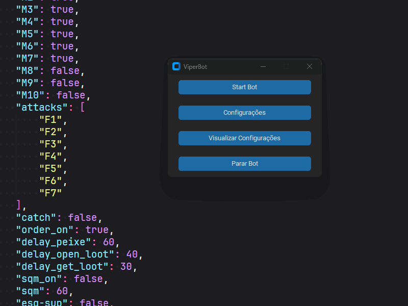

<h1 align="center">Bot Python</h1>

  

    <b>Bot documentation created in python for OtPokemon game</b>
     
    <a href="https://github.com/xjViper/Bot-Python.git"><strong>Explore the docs »</strong></a>
     
     
    <a href="#start-the-bot">View Demo</a>
    ·
    <a href="https://github.com/xjViper/Bot-Python/issues/new?assignees=&labels=bug&projects=&template=bug_report.md">Report Bug</a>
    ·
    <a href="https://github.com/xjViper/Bot-Python/issues/new?assignees=&labels=enhancement&projects=&template=feature_request.md">Request Feature</a>
  

<!-- TABLE OF CONTENTS -->

# Table of Contents

<b>(click to expand)</b>

1. [About The Project:](#about-the-project)
   1. [1.1. Built With:](#built-with)
   1. [1.2. Structure:](#structure)
1. [2. Usage:](#usage)
   1. [2.1. Configuration:](#configuration)
   1. [2.2. Start the Bot:](#start-the-bot)

---

<!-- ABOUT THE PROJECT -->

# About The Project:

This project is designed to simplify and enhance the fishing experience in the OtPokemon game. By using the Python programming language and its specialized libraries, such as opencv, ctypes and custom tkinter. I developed an intelligent system capable of automating the fishing process, allowing the player to devote their time to other activities while the bot takes care of repetitive tasks.

The motivation to create this tool arose from the need to optimize the time spent on fishing activity within the game. I understand that fishing is an essential part of the gameplay, but I also recognize that it can be a time-consuming and monotonous activity. My goal is to provide the player with a solution that allows him to enjoy other activities, such as using the computer to study, watching a video, while fishing is carried out efficiently in the background.

This project is a combination of programming skills and game knowledge. Using automation and simulation techniques, multithreading, OOP, I developed a system that accurately replicates a player's actions while fishing. From capturing Pokemon to storing your loot.

In addition to simplifying fishing itself, the project also includes advanced features such as reading the game's internal memory to check if the player is attacking something. This allows players to maximize their results and get the best items available.

(<a href="#readme-top">back to top</a>)

## Built With:

[![Python][Python]][Python-url]
[![Custom Tkinter][CustomTkinter]][CustomTkinter-url]
[![CTypes][Ctypes]][Ctypes-url]
[![Threading][Threading]][Threading-url]

(<a href="#readme-top">back to top</a>)

## Structure:

[![Structure of Project][Structure]](https://github.com/xjViper/Bot-Python.git)

(<a href="#readme-top">back to top</a>)

---

<!-- USAGE EXAMPLES -->

# Usage:

**The basic use of the project is to click the settings button to change the values and states of all the settings used in the project, after configuring just click the start button so that the bot starts working, whenever you need just press stop to the bot ceases its functions.**

Below are gifs to demonstrate the project setup, start and stop

<!-- CONFIGURATION EXAMPLES -->

## Configuration:

(<a href="#readme-top">back to top</a>)

<!-- START EXAMPLES -->

## Start the Bot:

(<a href="#readme-top">back to top</a>)

<!-- ROADMAP -->

<!-- ## Roadmap

- [ ] Feature 1
- [ ] Feature 2
- [ ] Feature 3
  - [ ] Nested Feature

(<a href="#readme-top">back to top</a>)
 -->

<!-- MARKDOWN LINKS & IMAGES -->
<!-- https://www.markdownguide.org/basic-syntax/#reference-style-links -->

[Python]: https://img.shields.io/badge/Python-3776AB.svg?style=for-the-badge&logo=Python&logoColor=white
[Python-url]: https://www.python.org
[CustomTkinter]: https://img.shields.io/badge/customtkinter-3775A9?style=for-the-badge&logo=pypi&logoColor=white
[CustomTkinter-url]: https://customtkinter.tomschimansky.com
[Ctypes]: https://img.shields.io/badge/ctypes-3775A9?style=for-the-badge&logo=pypi&logoColor=white
[Ctypes-url]: https://docs.python.org/3/library/ctypes.html
[Threading]: https://img.shields.io/badge/threading-3775A9?style=for-the-badge&logo=pypi&logoColor=white
[Threading-url]: https://docs.python.org/3/library/threading.html
[Structure]: ./assets/structure.png
