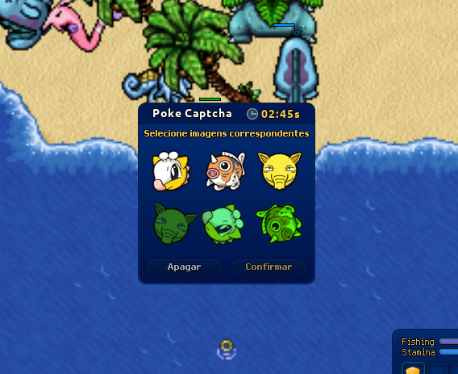

# Adicionar a Captcha Thread

## para resolver o captcha que aparece a cada poucos minutos durante a pesca

 

<b>(click to expand)</b>

>  
>
> ### Utilizar essa imagem para identificar o captcha na tela;
>
>  
>
> 
>
>  
>
> ### E com a mesma imagem encontrar a área em pixels do captcha;
>
>  
>
> ---
>
>  
>
> ### Como essa área da imagem abaixo:
>
>  
>
> 
>
>  
>
> ### Com a imagem da área do captcha, encontrar e separar as duas linhas do desafio;
>
>  
>
> ---
>
>  
>
> ### Como essa imagem abaixo:
>
>  
>
> 
>
>  
>
> ### Com as duas linhas separadas, cortar a imagem para cada uma das colunas, criando 6 imagens, cada uma de uma foto do captcha.
>
>  
>
> ---
>
>  
>
> ### Usar um filto cinza para remover a cor das imagens e comparar cada imagem única da primeira fileira com o desafio do segunda fileira;
>
>  
>
> ### Sempre que não for reconhecida nenhuma imagem semelhante, rotacionar as imagens.
>
>  
>
> ---
>
>  
>
> ### Quando 2 imagens derem match, remova as duas imagens da busca, para agilizar a resolução do captcha e
>
> ### Adicione as posições das duas em uma tupla, para que no final, o bot possa clicar nas duas sequencialmente e resolver o captcha
>
>  

 
 

---

 

# Adicionar a Bait Thread

## para repor as iscas de pesca sempre que faltar

 

<b>(click to expand)</b>

> ### Under Contruction

